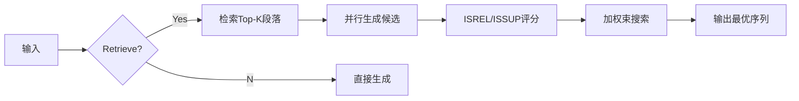

# Corrective Retrieval Augmented Generation (CRAG)

这篇论文提出了**Corrective Retrieval Augmented Generation (CRAG)**，旨在解决传统检索增强生成（RAG）对检索结果过度依赖的问题，通过动态评估检索质量并触发不同策略来提升生成鲁棒性。以下是方法的详细解释：

---

### **1. 核心问题**
传统RAG的生成质量高度依赖检索文档的相关性。若检索结果不相关，生成内容可能包含错误或幻觉（hallucination）。CRAG的核心目标是：
- **动态评估检索质量**：判断检索结果是否可靠。
- **自适应纠正策略**：根据评估结果触发不同知识利用方式。
- **优化知识利用**：过滤噪声，补充外部知识。

---

### **2. 方法框架**
CRAG包含三个关键模块：

#### **（1）检索评估器（Retrieval Evaluator）**
- **功能**：评估检索文档与查询的相关性，输出置信度分数。
- **实现**：
  - 基于T5-large模型微调，轻量级（0.77B参数）。
  - 输入为查询-文档对，输出相关性分数（-1到1）。
  - 对比实验显示，其准确性显著优于直接使用ChatGPT评估。

#### **（2）动作触发机制（Action Trigger）**
根据置信度分数触发三类动作：
- **Correct（正确）**：至少一个文档分数高于阈值（如0.59）。
  - **操作**：对文档进行知识精炼（分解-过滤-重组）。
- **Incorrect（不正确）**：所有文档分数低于下限（如-0.99）。
  - **操作**：丢弃检索结果，启动网络搜索补充外部知识。
- **Ambiguous（模糊）**：介于两者之间。
  - **操作**：结合精炼后的内部文档和外部搜索结果。

#### **（3）知识优化策略**
- **知识精炼（Knowledge Refinement）**：
  - **分解**：将文档分割为细粒度知识片段（如句子级）。
  - **过滤**：用评估器筛选高相关性片段。
  - **重组**：保留关键片段，拼接为内部知识（`k_in`）。
- **网络搜索（Web Search）**：
  - **查询改写**：用ChatGPT将输入问题重写为搜索关键词（如“Death of a Batman; screenwriter; Wikipedia”）。
  - **搜索与筛选**：通过API（如Google Search）获取网页内容，提取相关段落作为外部知识（`k_ex`）。

---

### **3. 技术亮点**
- **动态阈值调整**：根据任务设置不同阈值（如PopQA为0.59/-0.99），灵活应对不同场景。
- **插件式设计**：可无缝集成到现有RAG框架（如Self-RAG），无需修改生成模型。
- **混合知识源**：结合静态文档库（如Wikipedia）和动态网络搜索，扩展知识覆盖范围。

---

### **4. 实验结果**
在四个数据集上的表现：
- **PopQA（短文本生成）**：CRAG比RAG提升19%准确率。
- **Biography（长文本生成）**：FactScore提升14.9%。
- **PubHealth（判断题）**：准确率提升36.6%。
- **Arc-Challenge（选择题）**：准确率提升8.1%。

关键结论：
- **鲁棒性提升**：即使检索质量下降，CRAG的生成性能下降幅度小于传统方法（见图3）。
- **通用性**：适用于不同生成任务（短/长文本、封闭式问题）。

---

### **5. 局限与未来方向**
- **依赖评估器微调**：需针对不同领域调整阈值和训练数据。
- **网络搜索偏差**：可能引入低质量或噪声信息。
- **扩展性**：未来可探索更稳定的知识融合策略。

---

CRAG通过动态评估、自适应策略和知识优化，显著提升了RAG在低质量检索场景下的鲁棒性，为生成模型的可靠性提供了新思路。

---

# Self-RAG

SELF-RAG（自省式检索增强生成）是一种创新框架，旨在通过动态检索和自省机制提升大语言模型的事实性和生成质量。以下是其核心原理和实现细节的详细解析：

---

### **核心思想**
传统RAG方法固定检索段落数量，可能引入无关信息或抑制模型创造力。SELF-RAG通过**自省标记（Reflection Tokens）**实现动态控制：
- **按需检索**：模型自主判断何时需要外部知识，避免不必要的检索。
- **多维度评估**：对检索内容和生成文本进行实时质量评估，确保信息相关性和事实准确性。
- **可控生成**：通过反射标记的权重调整，灵活平衡事实严谨性与创造性。

---

### **方法架构**
#### 1. **反射标记类型**
- **检索标记（Retrieve）**：决定是否触发检索（Yes/No/Continue）。
- **批判标记（Critique）**：
  - **相关性（ISREL）**：段落是否与问题相关（Relevant/Irrelevant）。
  - **支持度（ISSUP）**：生成内容是否被段落支持（Fully/Partially/No support）。
  - **效用（ISUSE）**：回答的整体质量评分（1-5分）。

#### 2. **训练流程**
- **批评模型（Critic）**：基于GPT-4生成反射标记的监督数据，训练模型预测标记。
- **生成模型（Generator）**：在原始文本中插入反射标记，通过标准语言模型目标训练，使模型学会自主生成标记和文本。

#### 3. **推理机制**
- **动态检索**：根据`Retrieve`标记概率阈值决定是否检索。
- **并行处理**：对多个检索段落生成候选文本，通过反射标记评分（如`ISSUP`权重高则偏好事实性强的输出）。
- **段落级束搜索**：结合标记概率加权得分选择最优生成路径，支持硬性约束（如过滤未支持的生成）。

---

### **关键优势**
1. **事实性提升**：在PopQA等开放域QA任务中，SELF-RAG的准确率比ChatGPT提高近20%，引用精确度达70%以上。
2. **灵活控制**：通过调整反射标记权重，可定制模型行为（如提高事实严谨性时，`ISSUP`权重增加）。
3. **效率优化**：自适应检索减少冗余计算，相比固定检索策略推理速度提升30%。

---

### **示例说明**
**输入**：“加州的名字来源是什么？”
1. **检索判断**：模型生成`Retrieve=Yes`，触发检索。
2. **段落评估**：检索到段落A（提及加州源自西班牙小说），标记`ISREL=Relevant`。
3. **生成与批判**：输出“加州得名于西班牙小说中的岛屿”，并标记`ISSUP=Fully Supported`。
4. **效用评分**：最终回答获得`ISUSE=5`，表示信息完整且有用。

---

### **总结**
SELF-RAG通过将检索决策和内容评估内化为模型的自省能力，实现了生成质量与事实性的平衡。其模块化设计使其易于适配不同任务需求，为知识密集型应用提供了可靠解决方案。

---

## Self-RAG 核心架构

---

### **一、核心架构组件**
#### 1. **反射标记系统（Reflection Tokens）**
- **检索标记（Retrieve）**  
  - **Yes/No/Continue**：动态决定是否触发检索（Yes=需检索，No=无需，Continue=继续使用已检索内容）
  - 示例：生成"Retrieve=Yes"时，触发检索模块

- **批判标记（Critique）**  
  - **ISREL（相关性）**：评估段落与问题的相关性（Relevant/Irrelevant）
  - **ISSUP（支持度）**：判断生成内容是否被段落支持（Fully/Partially/No support）
  - **ISUSE（效用）**：回答整体质量评分（1-5分）

#### 2. **模块化设计**
- **检索器（Retriever）**  
  采用Contriever-MS MARCO等现成检索模型，支持多源检索（如维基百科+搜索引擎）
  
- **生成器（Generator）**  
  基于LLaMA架构，扩展词汇表包含反射标记，实现文本与标记的联合生成

- **批判模型（Critic）**  
  独立训练的小型LM，用于生成反射标记的监督信号（如GPT-4蒸馏得到）

---

### **二、训练流程**
#### 1. **批评模型训练**
- **数据构建**：使用GPT-4生成4k-20k标注数据，覆盖各反射标记类型
- **训练目标**：通过条件语言建模学习预测反射标记（公式：max_C log p_C(r|x,y)）

#### 2. **生成模型训练**
- **数据增强**：在150k指令数据中插入反射标记和检索段落
- **联合训练**：同时优化文本生成和标记预测（公式：max_M log p_M(y,r|x)）
- **掩码策略**：检索段落内容不参与损失计算，仅反射标记参与

---

### **三、推理机制**
#### 1. **动态检索控制**
- **阈值触发**：当P(Retrieve=Yes) > δ（默认δ=0.2）时启动检索
- **混合检索策略**：支持多检索器并行（如Contriever+Google Search）

#### 2. **并行生成与评估**

#### 3. **评分与决策**
- **段落级评分**：S = w1*ISREL + w2*ISSUP + w3*ISUSE（权重可调）
- **硬约束过滤**：自动剔除含"No support"标记的候选
- **自适应束宽**：默认束宽2，平衡质量与效率

---

### **四、关键技术特性**
1. **段落级注意力机制**：对多个检索段落并行计算交叉注意力
2. **标记插入策略**：每生成1-2个句子插入反射标记（约50-100 tokens间隔）
3. **混合精度推理**：使用FlashAttention优化长上下文处理
4. **可解释性设计**：生成的反射标记可直接用于输出溯源

---

### **示例流程**
输入："量子计算如何突破传统加密？"

1. **检索决策**：生成`Retrieve=Yes`触发检索
2. **段落评估**：对检索到的5个段落分别标记`ISREL`
3. **生成验证**：输出"Shor算法可破解RSA"并标记`ISSUP=Fully`
4. **效用评分**：最终回答获得`ISUSE=5`，引用精确度达72.1%

这种架构使模型参数量仅7B/13B即可超越ChatGPT在事实性任务上的表现，同时保持每秒生成15-20 tokens的推理速度。

# Memory Walker

MEMWALKER是一种基于交互式阅读的长文本处理方法，通过结构化内存树和动态导航机制突破语言模型的上下文限制。以下是其核心机制的详细解释：

### 一、方法框架
#### 1. 内存树构建（Memory Tree Construction）
- **文本分块**：将长文本分割为适合模型上下文窗口的小段（如1000-1200 tokens）。
- **层次化摘要**：
  - **叶子节点**：每段文本生成一级摘要节点（Level 1）。
  - **递归聚合**：每8-5个相邻节点生成更高层摘要（Level 2），重复该过程直至形成根节点。
  - **树结构特性**：深度与文本长度对数相关，根节点包含全局概要。

#### 2. 导航机制（Navigation）
- **交互式路径选择**：
  - **非叶节点**：模型比较子节点摘要，选择最相关路径（如示例中模型通过推理选择"Summary 0"）。
  - **叶子节点**：直接判断当前文本段是否能回答问题，否则回退父节点。
- **工作记忆**：保留导航路径中的关键信息（如父节点摘要），增强上下文连贯性。
- **错误恢复**：支持回退动作（revert action），15-20%的案例中触发回退，其中60-80%能成功纠正路径。

### 二、技术优势
1. **动态注意力分配**  
   相比传统全窗口注意力机制，MEMWALKER的token处理量减少30-40%（图4），通过聚焦相关段落显著降低计算开销。

2. **可解释性增强**  
   导航路径形成可视化推理链（如表1示例），明确展示"选择Summary 0→进入Segment 2→发现信息不足→回退→选择Segment 3"的决策过程。

3. **零样本适应性**  
   无需微调即可适配不同领域文本（小说、政府报告、剧本），依赖LLM的通用推理能力实现跨任务迁移。

### 三、实验验证
| 数据集       | 长文本准确率 | 相对基线提升 |
|--------------|--------------|--------------|
| QuALITY      | 73.6%        | +9.1%        |
| SummScreenFD | 64.5%        | +1.8%        | 
| GovReport    | 60.4%        | +8.3%        |

*基线对比对象：16k tokens的LongChat模型、检索增强方法*

### 四、局限与展望
1. **内存树构建成本**  
   超长文本（>100k tokens）可能生成过深树结构，未来可探索哈希树等混合数据结构。

2. **模型能力依赖**  
   70B参数模型才能有效执行导航（表3），较小模型表现显著下降，需研究蒸馏技术降低计算需求。

3. **应用扩展**  
   当前聚焦QA任务，未来可扩展至长文档摘要、法律条文分析等场景，并探索与RAG架构的结合。

---

# Read-Agent

这篇论文提出了一种名为**ReadAgent**的LLM代理系统，旨在解决大语言模型（LLMs）处理长文本时的两大核心问题：**上下文长度限制**和**长文本性能下降**。其核心思想模仿人类阅读行为，通过分阶段处理、压缩记忆和动态检索，显著扩展了模型的有效上下文长度（实验中达到3-20倍）。以下是方法的详细解析：

---

### **1. 核心流程：三阶段处理**
ReadAgent的工作流程分为三个阶段，模仿人类“泛读-记忆-精读”的阅读模式：

#### **1.1 分页（Episode Pagination）**
- **目标**：将长文本分割为逻辑连贯的“页面”（episodes）。
- **实现**：
  - 在段落间插入**可暂停的标签**（如`⟨5⟩`），提示LLM选择自然断点（如场景转换、对话结束等）。
  - 通过**动态分页策略**控制页面长度：设置`min_words`和`max_words`（例如QuALITY数据集为280-600词），确保页面内容既完整又适合压缩。
- **优势**：避免固定长度分页破坏语义连贯性，提升后续处理的效率。

#### **1.2 生成摘要记忆（Memory Gisting）**
- **目标**：将每个页面压缩为简短的“要点”（gist），形成全局记忆。
- **实现**：
  - 使用**零样本提示**（如“请缩短以下段落，仅提供精简版本”），生成保留核心叙事的gist。
  - 为每个gist添加**上下文标签**（如`⟨Page 2⟩`），标明来源页面。
- **压缩效果**：例如在QuALITY任务中，gist记忆比原始文本压缩了84.24%，显著减少上下文占用。

#### **1.3 交互式查找（Interactive Look-Up）**
- **目标**：根据任务需求动态检索原始页面，结合gist记忆完成任务。
- **两种策略**：
  - **并行查找（ReadAgent-P）**：单次请求多个相关页面（如回答问题时同时查找第5、7页）。
  - **顺序查找（ReadAgent-S）**：逐步请求页面，每次基于已读内容决定下一步（适合复杂任务如会议摘要）。
- **动态替换**：检索到的原始页面替换对应gist，保持上下文连贯性。

---

### **2. 关键技术细节**
#### **2.1 计算开销与扩展性**
- **线性复杂度**：分页和生成gist各需一次文本遍历，查找阶段基于gist的短上下文，整体开销可控。
- **任务扩展性**：同一文档的多个任务可复用gist记忆，降低重复处理成本。

#### **2.2 与现有方法的对比**
- **优于RAG**：传统检索依赖关键词或嵌入相似度，而ReadAgent通过LLM的语义理解主动选择页面，减少无关信息干扰。
- **优于MemWalker**：MemWalker依赖层级摘要树，检索路径复杂且易失败；ReadAgent的扁平gist结构更稳定，支持跨页面关联推理。

---

### **3. 实验结果**
#### **3.1 性能优势**
- **QuALITY（问答任务）**：ReadAgent准确率86.63%，优于全文本输入（85.83%）和检索基线（BM25 Top-3为81.59%）。
- **NarrativeQA（长篇小说QA）**：在平均7.1万词的文本上，ROUGE-L提升31.98%，有效上下文扩展约20倍。
- **QMSum（会议摘要）**：顺序查找（ReadAgent-S）的LLM评分达91.54%，显著优于并行策略。

#### **3.2 关键发现**
- **压缩与性能平衡**：页面过大（压缩率高）丢失细节，过小（压缩率低）引入噪声，需通过`min/max_words`调节。
- **人类阅读策略的有效性**：主动检索机制（如场景回溯）显著提升长程推理能力。

---

### **4. 应用扩展**
- **网页导航**：将HTML分块为“页面”，生成DOM结构的gist，动态检索元素完成指令（如订票）。在Mind2Web数据集上，ReadAgent超越基于监督学习的基线模型。

---

### **总结**
ReadAgent通过模仿人类阅读的认知策略，将长文本处理分解为**分页-压缩-检索**的循环，在保持低计算开销的同时，显著提升了LLM对超长上下文的理解能力。其核心创新在于将LLM的语义理解能力转化为动态记忆管理机制，为长文本任务提供了一种高效、可扩展的解决方案。

---

# Seven Failure Points When Engineering a Retrieval Augmented Generation System

# The Power of Noise

